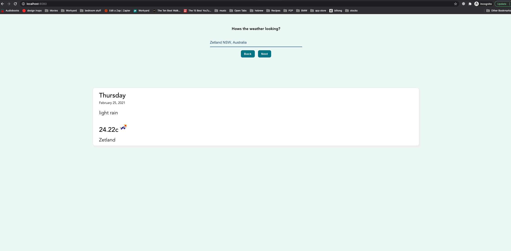

# weather-widget

## Project setup

- Add google api key in `config.js` file

* run `yarn install`

### Compiles and hot-reloads for development

```
yarn serve
```

### Compiles and minifies for production

```
yarn build
```

### Lints and fixes files

```
yarn lint
```

### Example Page


